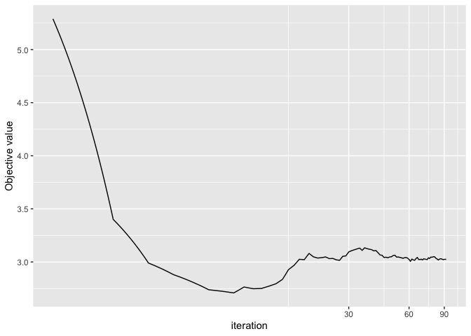
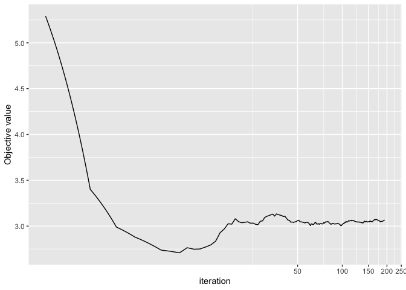

<!-- README.md is generated from README.Rmd. Please edit that file -->

# RRRR

<!-- badges: start -->

[](https://travis-ci.org/FinYang/RRRR)
<!-- badges: end -->

The R package *RRRR* provides methods for estimating online Robust
Reduced-Rank Regression.

To cite package ‘RRRR’ in publications use:

> Yangzhuoran Yang and Ziping Zhao (2020). RRRR: Online Robust
> Reduced-Rank Regression Estimation. R package version 1.0.0.
> <https://pkg.yangzhuoranyang.com/RRRR/>.

## Installation

The **stable** version on R CRAN is coming soon.

You can install the **development** version from
[Github](https://github.com/FinYang/RRRR) with:

``` r
# install.packages("devtools")
devtools::install_github("FinYang/RRRR")
```

## Usage

The R package *RRRR* provides the following estimation methods.

1.  Reduced-Rank Regression using Gaussian MLE: `RRR`
2.  Robust Reduced-Rank Regression using Majorisation-Minimisation:
    `RRRR`
3.  Online Robust Reduced-Rank Regression: `ORRRR`
      - SMM: Stochastic Majorisation-Minimisation
      - SAA: Sample Average Approximation
4.  Online update of the above model (except `RRR`): `update.RRRR`

See the vignette for a more detailed illustration.

``` r
library(RRRR)
set.seed(2222)
data <- RRR_sim()
res <- ORRRR(y=data$y, x=data$x, z=data$z)
plot(res)
```

<!-- -->

``` r

newdata <- RRR_sim()
res2 <- ORRRR(y=newdata$y, x=newdata$x, z=newdata$z)
plot(res2)
```

<!-- -->

## License

This package is free and open source software, licensed under GPL-3.
